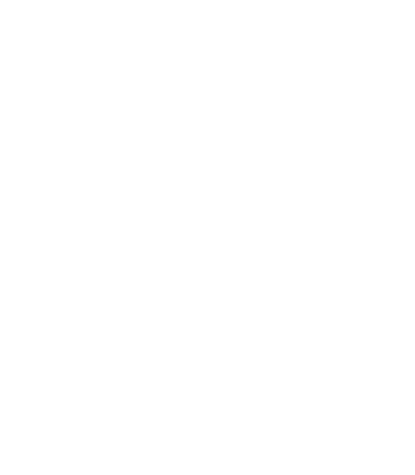

# bio-sync-3-ciclo

 

 
  

 

<strong>Projeto Interdisciplinar Fatec Matão</strong> - O projeto se resume em um ambiente virtual que busca dar visibilidade a pequenos coletores de resíduos e incentivar e influenciar positivamente na sociedade focando em Sustentabilidade e Meio Ambiente

## Informações Gerais

 

Abaixo estará as instruções gerais necessárias do processo de construção do projeto, porém, as instruções estão suspeitas a alterações no decorrer do desenvolvimento.

 

## Branchs e Desenvolvimento em Squad

 

Devs, a priori trabalharemos com 3 camadas(branchs) de versionamento, a branch 'main' será utilizada para o código de produção, ou seja, em hipótese alguma codifique diretamente nessa branch, já a branch 'release' é a camada onde iremos realizar a homologação e testes internos antes de subir o código para produção, por fim a branch 'dev' é o ambiente onde teremos a versão de código mais recente para desenvolvimento.

<strong>ATENÇÃO</strong>: Ao iniciar uma task e se nela for necessário codar, favor criar uma branch pessoal temporária e fazer um pull da camada 'dev' para ter a versão mais recente do código, após isso pode realizar as alterações e ações necessárias e depois das alterações fazer um push novamente para a 'dev'. Se o processo for concluído com sucesso sem erros ou bugs a branch temporária pode ser exlcuída para evitar qualquer tipo de confusão e manter nosso repositório organizado.
